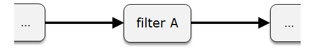
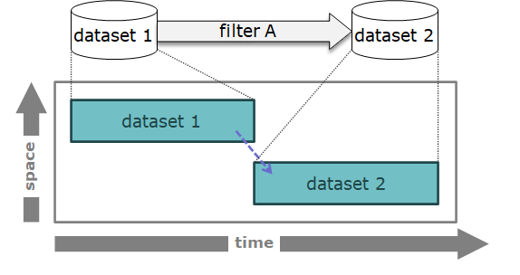
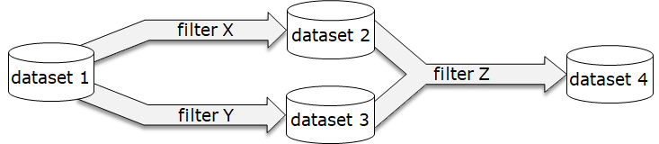

# TtDT - Report - Building resilient dataset transformation transparency

# Introduction

bCLEARer stage pipelines work at the level of datasets rather than
dataset collections and so have a structure that offers substantially
more opportunities for accounting. In this section the focus is on
building transformation transparency for those datasets.

After a section setting the scene, the following topics are covered:

-   firstly, a general notion of algorithmic identity, from which
    difference and so transformation can be established, and

-   secondly, how to implement transparency in the individual bCLEARer
    stage pipelines through tracking, tracing and testing
    transformations.

The discussion of the second topic is divided into three sections:

1.  mapping tracking of intended identities

2.  mapping tracing of intended changing identities

3.  testing tracking and tracing for actual executions

[]{#Bookmark58}

# Setting the scene

The bCLEARer stage is designed as a sequence of bUnit [process
]{.inline-comment-marker
ref="175eab42-9f32-43f8-adf1-1211df4514d7"}types -- the bUnit flow --
which may or may not be organised into sub-pipelines within the stage.
It is important that this flow is not only transparent, open to
inspection, but that the transparency is also resilient in the face of
change.

A bUnit process type can be characterised as a type of process that
consumes one or more (input) [dataset ]{.inline-comment-marker
ref="1bffc318-09ce-4587-a91f-806063792ffc"}types and produces one or
more new (output) [dataset ]{.inline-comment-marker
ref="1469d260-110b-438e-8174-ac1eff4f87ea"}types. At this level, unlike
the higher levels which work with dataset collections, dataset types are
individuated, where each dataset type is picked out as separate. So
process types have associated flow mappings -- mappings from the
individual input dataset type and to the individual output dataset type.

The components of the bUnit flow, the bUnit process and dataset types,
are identified using a name, typically reflecting its function, that is
unique within the bUnit, which is often supplemented with a project-wide
(code) identifier. When the bUnit dataset flow is run, the run is given
an identifier. The datasets and processes in the run are identified by
the combination of the type identifier and the run identifier.

In the context of bUnit flow, a dataset is a collection of data items in
a common format -- where a data item is a single unit of data. A tabular
row dataset -- a common type of dataset -- is a table where the data
items are the rows (these rows have an internal structure/content stored
in cells based upon the table\'s columns). Another common case is a
tabular cell dataset where the data items are the table's cells
themselves.

One can visualise the bUnit flow in a number of ways. Firstly, from the
perspective of the process types -- see below.

[{.confluence-embedded-image
.image-center width="442"
height="69"}]

Secondly from the perspective of process and dataset types, where the
pipes are adorned with a dataset icon -- see below.

[{.confluence-embedded-image
.image-center width="442"
height="90"}]

And finally from a pure dataset type perspective, a bUnit dataset flow,
showing a sequence of datasets -- see below.

[{.confluence-embedded-image
.image-center width="442"
height="89"}][]{#Bookmark59}

# A general notion of algorithmic dataset identity {#Bookmark59}

In the bCLEARer stage pipeline design process, one defines (and so, in
this scheme of things, gives identity to) bUnit dataset types and their
associated bUnit filter types. In the diagram below, 'dataset 1' and
'dataset 2\' are bUnit dataset types associated with bUnit filter type
\'filter A'. These names help humans keep track of the identities for
the bUnit datasets and process types. In the implementation there will
be internal identifiers corresponding to these for the computer to use.

[{.confluence-embedded-image
.image-center width="442"
height="90"}]

Filters are where transformations happen. From the perspective of
datasets, we can be more specific and locate it as a property of the
relation between a filter\'s input dataset and output dataset -- a
filter-dataset flow. This is perhaps more easily visualised when the
flow is seen from the dataset perspective, as in the diagram below.

[

So the starting point for inspecting dataset transformations is these
filter-dataset flows. To make them more concrete we can list them in a
table -- as done below.

  ------------------- ----------------- ------------------
  **bUnit process**   **bUnit input**   **bUnit output**
  filter A            dataset 1         dataset 2
  ------------------- ----------------- ------------------

To enable tracking and tracing of dataset transformations one firstly
needs to identify the types of dataset identities that are to be tracked
and traced. Then one can ask for their filter-dataset flows, showing
where these identities are preserved.

The two core types of algorithmic dataset identity bCLEARer works with
at the moment are:

1.  dataset item identity

2.  dataset item immutable stage identity

As these are all algorithmic identities, they can be tested
automatically. bCLEARer implements these algorithms using
[counts]{.inline-comment-marker
ref="71b21519-489a-48cf-b05d-c6bda4d127a2"}, sums and hashes (which are
described here: [TtDT - Report - Appendix - bH - bHashing and
bSumming](../page5768839184#Bookmark95 "TtDT - Report - Appendix - bH - bHashing and bSumming"){linked-resource-id="5768839184"
linked-resource-version="4" linked-resource-type="page"}) and stores
them as metadata on all the bUnit datasets. This makes it easy to test
for unexpected differences.

These identities are described below.

## Dataset item identity {#Bookmark60}

The first type of algorithmic identity is dataset item identity. This is
based upon immutability of the collected data items\' identities. In a
bUnit filter where an input dataset type is intended to have a
corresponding output dataset type that collects exactly the 'same' data
items -- where sameness is based upon data item identity -- then they
share dataset item identity. [The content of the data items may change
-- for example, a column may be dropped -- but this does not affect the
dataset identity]{.inline-comment-marker
ref="468ba323-fa04-4fe1-bde1-d015643f9d2f"}. However, a merge or split
of a dataset, where the collected data items change will not qualify for
dataset item identity.

Reconsider the example above. Assume we intend that filter A preserves
dataset item identity, then we could record the transformation
characteristics to the filter-dataset flow as shown in the table below.

  ------------------- ----------------- ------------------ -----------------------
  **bUnit process**   **bUnit input**   **bUnit output**   **identity**
  filter A            dataset 1         dataset 2          dataset item identity
  ------------------- ----------------- ------------------ -----------------------

Where a filter-dataset flow has this characteristic, when it is executed
we test the identity. Where there is a difference, this is reported and
should be investigated -- we discuss this further in the testing section
below.

Of course, it is possible that there are multiple item identities that
that dataset is tracking, but we only consider the case where there is
one here.

## Dataset item immutable stage identity {#Bookmark61}

The second type of algorithmic identity is dataset item immutable stage
identity -- this is based upon immutability of the collected data
items\' content (including their identities). This follows a similar
pattern to the identity described above.

In a bUnit filter, such as a pass-through, where an input dataset is
intended to have a corresponding output dataset type that collects
exactly the 'same' data items with their content unchanged -- then they
share dataset item immutable stage identity. In this case, dropping a
column from the dataset would change the contents, so they wouldn't
share this identity. This can be regarded as a more stringent kind of
dataset item identity -- as dataset item immutable stage identity
implies d[ataset item identity.]

Reconsider again the filter A example. Assume we now intend filter A to
preserve dataset item immutable stage identity, then we could record the
transformation characteristics to the filter-dataset flow as shown in
the table below.

  ------------------- ----------------- ------------------ ---------------------------------------
  **bUnit process**   **bUnit input**   **bUnit output**   **identity**
  filter A            dataset 1         dataset 2          dataset item immutable stage identity
  ------------------- ----------------- ------------------ ---------------------------------------

Where a filter-dataset flow has this characteristic, when the pipeline
is executed we test for this identity. Where there is a difference, this
is reported and should be investigated -- we discuss this further in the
testing section below. In practice, we will need to differentiate
between cases where we expect the dataset and associated data items\'
identity to always change and where they may change, but don't
necessarily. in this exposition we gloss over this distinction.

Where a dataset is processed and the input and output versions both
collect the 'same' data items with the same content, then they are the
same dataset immutable stage. Where the content of a data item changes
-- for example, a column is dropped -- this marks the end of the dataset
immutable stage but does not affect the dataset identity.

The obvious candidate for stage identity based upon content immutability
is the maximal content of the dataset. For example, in the case of
tables, this would be all the data columns. There will be cases where
the content naturally divides into sub-content and so can be usefully
tracked in finer detail. However we only consider the case where there
is a single (maximal) notion of content here.

# Tracking intended dataset identities {#Bookmark62}

In this context, tracking means following the intended flow of the two
identities through the bUnit pipeline. In other words, for a particular
dataset identity, which bUnit datasets (pipes) it is intended to pass
through. This involves mapping where it is intended to be preserved
across bUnit filters. We describe this in more detail in this section.

## Tracking a simple pass-through {#Bookmark63}

Consider first a simple pass-through pipeline visualised in the figure
below.\

This gives rise to the filter-dataset transformation characteristics in
the table below.

  ------------------- ----------------- ------------------ ---------------------------------------
  **bUnit process**   **bUnit input**   **bUnit output**   **identity level**
  pass-through        dataset 1         dataset 2          dataset item identity
  pass-through        dataset 1         dataset 2          dataset item immutable stage identity
  ------------------- ----------------- ------------------ ---------------------------------------

From this table we can infer that there is a dataset, of which dataset 1
and dataset 2 are bUnit filter stages -- dataset A. We can also infer
that this dataset is its own immutable stage, as it is immutable
throughout its life. [This means it has two
names]{.inline-comment-marker
ref="5540785e-031a-47dc-b3ca-8c95d2760652"}. We tend to use the shorter
names in diagrams and have both in one of the tables for reference (here
you can find both names in a later table). This structure can be
visualised as a [tracking life history] -- as shown in the figure
below.\

The tracking is recorded in the component structure. In this case, where
the bUnit dataset is a stage in the life of the larger dataset. This
structure can be recorded in a tracking table, such as the one below.

  --------------- ---------------------------------------------
  **composite**   **tracked component**
  dataset A       dataset 1 / dataset A bUnit stage dataset 1
  dataset A       dataset 2 / dataset A bUnit stage dataset 2
  --------------- ---------------------------------------------

[The stage succession structure can also be recorded in a table]

  --------------------------------------------- --------------------------------------------- -------------
  **before**                                    **after**                                     **type**
  dataset 1 / dataset A bUnit stage dataset 1   dataset 2 / dataset A bUnit stage dataset 2   bUnit stage
  --------------------------------------------- --------------------------------------------- -------------

# Tracing intended dataset identities {#Bookmark64}

In this context, tracing means identifying the intended flow of
transformation based upon multiple tracked identities. This involves
mapping where the bUnit filters intend a transformation. We describe
this in more detail in this section.

### Tracing simple dataset stage successions {#Bookmark65}

It can be intended that a dataset remain immutable throughout its life.
Or, it can be intended that datasets can change (be mutable). In the
bCLEARer stage pipeline, the changes translate into a series of
immutable stages. The tracing marks out the sequence of stages.

Consider the simple single filter pipeline in the figure below.\

Assume filter A preserves dataset identity, but transforms the content
(in some way). This gives rise to the mapping table below.

  ------------------- ----------------- ------------------ -----------------------
  **bUnit process**   **bUnit input**   **bUnit output**   **identity level**
  filter A            dataset 1         dataset 2          dataset item identity
  ------------------- ----------------- ------------------ -----------------------

From this one can infer the existence of dataset A and its two immutable
stages that are identical with their corresponding bUnit datasets. We
can record this in an existence table like that below.

  ---------------------- -------------------------------------------------------
  **Identity dataset**   **component**
  dataset W              dataset 1 / dataset W immutable bUnit stage dataset 1
  dataset W              dataset 2 / dataset W immutable bUnit stage dataset 2
  ---------------------- -------------------------------------------------------

For tracing purposes, one also needs to identify the succession
transformation. This can be inferred algorithmically from the previous
tables. One can record them in an succession table like that below.

  ------------------------------------------- ------------------------------------------- -------------------
  **prior dataset stage**                     **post dataset stage**                      **bUnit process**
  dataset W immutable bUnit stage dataset 1   dataset W immutable bUnit stage dataset 2   filter A
  ------------------------------------------- ------------------------------------------- -------------------

This trace can be shown visually in a life history.\

## Tracing simple dataset successions {#Bookmark66}

Consider a simple single filter pipeline whose bUnit filter is designed
to take a dataset as input and output, based upon this, a different
dataset. Then the dataset identity table is empty, as no identities are
preserved. But there is an intended transformation, the emergence of a
new dataset, that needs to be traced.

Reconsider the pipeline in the figure above. In this example, assume
dataset 2 is a new dataset, different from dataset 1. In this simple
case, the bUnit dataset flow links the two (distinct) bUnit datasets.

For tracing purposes one also needs to identify the dataset emergence
transformation -- the links from the emerging dataset back to the
dataset it is immediately dependent upon. This can be inferred
algorithmically from the filter and recorded in an mapping table like
that below.

  ------------------- ------------------ -------------------
  **prior dataset**   **post dataset**   **bUnit process**
  dataset 1           dataset 2          filter A
  ------------------- ------------------ -------------------

This trace can be shown visually in a life history.\

## Tracking and tracing branches {#Bookmark67}

The bCLEARer stage pipeline flow can split-and-merge, which creates the
possibility for the dataset identities to split and merge as well.
Consider the pipeline in the figure below.\

[

Assume the filters (whatever they are) just preserve data item identity,
so not immutable stage identity. This gives rise to the mapping table
below.

  ------------------- ----------------- ------------------ -----------------------
  **bUnit process**   **bUnit input**   **bUnit output**   **identity level**
  filter X            dataset 1         dataset 2          dataset item identity
  filter Y            dataset 1         dataset 3          dataset item identity
  filter Z            dataset 2         dataset 4          dataset item identity
  filter Z            dataset 3         dataset 4          dataset item identity
  ------------------- ----------------- ------------------ -----------------------

The lack of dataset item immutable stage identity implies that there is
a dataset item immutable stage difference. The dataset item identity
implies the existence of a dataset persisting through the bUnit dataset
flow -- dataset A -- of which the bUnit datasets are components -- as
shown in the table below.

  --------------- -------------------------------------------------------
  **composite**   **component**
  dataset A       dataset 1 / dataset A immutable bUnit stage dataset 1
  dataset A       dataset 2 / dataset A immutable bUnit stage dataset 2
  dataset A       dataset 3 / dataset A immutable bUnit stage dataset 3
  dataset A       dataset 4 / dataset A immutable bUnit stage dataset 4
  --------------- -------------------------------------------------------

The earlier mapping table [provide ]{.inline-comment-marker
ref="889c8a95-14d3-4c32-ac95-1285b090613c"}the basis for immutable stage
tracing relations between the bUnit datasets. The resulting life history
below visualises the tracking -- using components, and tracing -- using
arrows.

[

Or it can be recorded in a table, such as the one below.

  --------------- -----------------------------------------------
  **composite**   **tracked component**
  dataset A       dataset 1 / dataset A immutable bUnit stage 1
  dataset A       dataset 2 / dataset A immutable bUnit stage 2
  dataset A       dataset 3 / dataset A immutable bUnit stage 3
  dataset A       dataset 4 / dataset A immutable bUnit stage 4
  --------------- -----------------------------------------------

There are successions between the bUnit dataset stages. These are
identified and recorded as part of tracing[, which is the topic of the
next section.]

# Testing identity {#Bookmark68}

Once the intended tracks and traces have been identified (as described
in the two previous sections), they can be used when the pipeline is
executed to test whether identity is being preserved as intended. The
pipeline has been implemented so that every bUnit dataset has immutable
metadata; a count, hashsums for item identity and immutable stage
identity, and a hash for bUnit stage identity. Each bUnit filter has a
corresponding inspection filter that has access to its dataset's
metadata. This is shown graphically in the figure below.

[

The inspection filter uses the dataset metadata as the basis for
testing, as described in the next sections.

## Testing a simple pass through {#Bookmark69}

Assume we have a simple pass-though filter as discussed earlier and
shown in the figure below. As it is a pass through, dataset and
immutable stage identity are preserved, as shown in the life history.

[

In the pipeline, the associated inspection process has access to the
dataset metadata -- as shown in the figure below.

[

It uses the track and trace maps to test the transformations. In this
case, all non-bUnit items of metadata should match (bUnit stage
identities should never match).

## Testing a simple column drop {#Bookmark70}

Now assume we have a simple filter where the dataset has its content
transformed -- by, for example, dropping a column or two. In this case,
dataset identity is preserved, but immutable stage identity is not, as
shown in the life history.

[

In the pipeline, the associated inspection filter has access to the
dataset metadata -- as shown in the figure below.

[

It uses the track and trace mapping to test the transformations. In this
case, only the first item of metadata (identity_hashsum) should match.

## Testing a simple dataset split {#Bookmark71}

Testing splits [(and merges - see below)]{.inline-comment-marker
ref="60fd11a1-5f4a-46e8-83c2-292ad1e4776f"} requires a little more
calculation than simple matching. Consider the split shown in the figure
below. In this case, the sum of the two output items should match the
input items.

[

## Testing a simple dataset merge {#Bookmark72}

[Consider the merge shown in the figure below. In this case, the input
items should match the sum of the two output
items.]

[{.confluence-embedded-image
.image-center}]{.confluence-embedded-file-wrapper
.image-center-wrapper}[]{#Bookmark73}

## Expanding the testing {#Bookmark73}

We have only covered a small range of the possible tests that can be
done with bCLEARer stage pipelines. But hopefully this is enough to give
a good idea of the kinds of test that are feasible.
