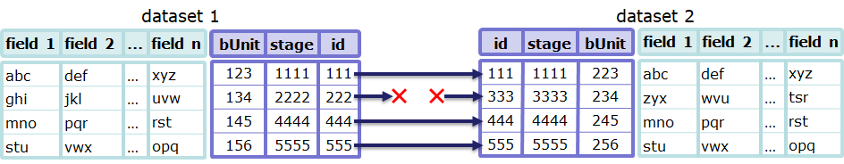
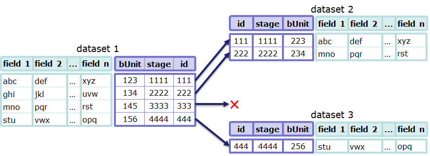

# TtDT - Report - Building resilient data item transformation transparency

# Introduction {#Bookmark75}

In this section the focus is on building transformation transparency for
data items. This is done in the context of the bCLEARer stage pipeline
datasets.

As in the previous section, after a section setting the scene, the
following topics are covered.

-   Firstly, a general notion of algorithmic identity, from which
    difference and so transformation can be established, and

-   Secondly, how to implement transparency in the individual bCLEARer
    stage pipelines through tracking, tracing and testing
    transformations.

And, as before, the second topic is divided into three parts:

1.  mapping tracking of intended identities

2.  mapping tracing of intended changing identities

3.  testing tracking and tracing for actual executions

[]{#Bookmark76}

# Setting the scene {#Bookmark76}

The previous section looked at the bUnit flow as a sequence of bUnit
process types -- and how, at the dataset level, one could make this not
only transparent, open to inspection, but also resilient in the face of
change. It characterised a bUnit process type as a type of process that
consumes one or more (input) dataset types and produces one or more new
(output) dataset types.

The same pattern is recapitulated at the finer-grained level of data
items. Each bUnit dataset is a collection of data items -- the bUnit
data items. The bUnit item process type consumes one or more (input)
data item types and produces one or more new (output) data items. So
item process types have associated item flow mappings -- mappings from
the individual input data items and to the individual output data items.
One can visualise this in a similar way to datasets as in the figure
below.\

[

# A general notion of algorithmic data item identity {#Bookmark77}

To enable tracking and tracing (of algorithmic data item identities) one
firstly needs to identify the data item identities to track and trace.
Then one maps them onto the bUnit item identities in the bCLEARer stage
pipelines. This gives one a basis for testing the tracking and tracing.

The two core types of algorithmic data item identity bCLEARer works with
at the moment are the same as for datasets:

1.  data item identity

2.  data item immutable stage identity

These identities are described below.

[]{#Bookmark78}

## Data item identity {#Bookmark78}

The first type of algorithmic identity is data item identity. Whenever a
data item comes into the scope of the pipeline, whether being passed
into the pipeline from a data source or created by a filter in the
pipeline, it is allocated a unique data item identity. It is the
responsibility of the first filter to handle the data item to generate
the identity and attach it to the data item.

The specific algorithm is selected during the bCLEARer stage pipeline
design process. There are various ways of doing this and the choice will
depend upon the context. In the case of tables, this is usually based
upon a primary key of some kind. If there are no keys, then it can be
based upon something as simple as a row count. The ways bCLEARer
implements the algorithm is described here: [TtDT - Report - Appendix -
bH - bHashing and
bSumming](../page5768839184#Bookmark95 "TtDT - Report - Appendix - bH - bHashing and bSumming"){linked-resource-id="5768839184"
linked-resource-version="4" linked-resource-type="page"}, often these
are hashes.

The identity travels along the pipeline flow and is stored in subsequent
versions of the data item -- in subsequent datasets. It is the
responsibility of the filters that write data items to ensure when
outputting one that the identity is passed through.

Of course, it is possible that there are multiple data item identities
that need to be tracked, but we only consider the case where there is
one here.

[]{#Bookmark79}

## Data item immutable stage identity {#Bookmark79}

The second type of algorithmic identity is data item immutable stage
identity -- this is based upon immutability of the data items\' content
(including their identities). As with the previous identity, whenever a
data item comes into the scope of the pipeline, whether being passed
into the pipeline from a data source or created by a filter in the
pipeline, it is allocated a unique data item immutable stage identity.
It is the responsibility of the first filter to handle the data item to
generate the identifier and attach it to the data item.

The specific algorithm for this identity is selected during the bCLEARer
stage pipeline design process. There are various ways of doing this and
the choice will depend upon the context. In the case of tables, this is
usually based upon the content of a row. The ways bCLEARer implements
the algorithm is described here: [TtDT - Report - Appendix - bH -
bHashing and
bSumming](../page5768839184#Bookmark95 "TtDT - Report - Appendix - bH - bHashing and bSumming"){linked-resource-id="5768839184"
linked-resource-version="4" linked-resource-type="page"}, often these
are hashes.

This follows a similar pattern to the other identity described above.

Where the filter does not change the content of a data item, then this
identity travels along the pipeline flow and is stored in subsequent
versions of the data item -- in subsequent datasets. It is the
responsibility of the filters that write data items to ensure when
outputting one that the identity is passed through. However, where the
filter does not change the content of a data item, a new identity needs
to be algorithmically calculated and attached to the data item.

As noted previously, the obvious candidate for a data item's stage
identity based upon content immutability is its maximal content. For
example, in the case of tables, this would be all the columns in the
row. There will be cases where the content naturally divides into
sub-content and so can be usefully tracked in finer detail. However we
only consider the case where there is a single (maximal) notion of
content here.

[]{#Bookmark80}

## Relation to dataset identities {#Bookmark80}

Data item identity and dataset identity are closely linked. The intended
dataset identity depends upon the intended data item identity. Hence,
one can infer intended data item identity from intended dataset identity
-- if dataset identity is preserved then data item identity must be too.
We identified the possible routes for dataset transformations as the
filter\'s input/output dataset combinations -- a filter-dataset flows.
Data item transformations have the same routes at the finer granularity
of items -- filter-data-item flows. A filter-dataset flow that preserves
dataset identity will include finer grained filter-data-item flows that
preserve data item identity. But there are cases (dataset splits and
merges are an example) where dataset identity is not preserved, but
there are finer grained filter-data-item flows that preserve data item
identity -- we will look at examples later in this section.

[]{#Bookmark81}

## Representing identities as metadata {#Bookmark81}

In our diagrams, we will represent the identities as metadata in two
ways - as shown below. On the left, the metadata is represented using a
\'tag\', on the right as columns in a metadata table.

[]

# Tracking intended data item and stage identities {#Bookmark82}

In this context, tracking means identifying the intended flow of the two
identities through the bUnit pipeline -- for a particular data item
identity, which bUnit datasets it is intended to overlap, to have as
stages. This involves mapping where it is intended to be preserved
across bUnit filters. We describe this in more detail below reusing
using examples introduced for dataset identity.

[]{#Bookmark83}

## Tracking a simple pass-through {#Bookmark83}

We start with a simple pass-through pipeline example that preserves
dataset item identity and dataset item immutable stage identity. The
pass-through filter will read a data item from the input dataset and
write the same data item with the same content to the output dataset.
This implies that both data item identities are preserved. We can
visualise that using an example diagram such as that below.

[

Both data items have their three identities as metadata. And as the
figure shows all non-bUnit items of metadata should match (bUnit stage
identities should never match).

The specific data item identities depend upon the contents of the input
dataset, so we can record the general transformation characteristics to
the filter-data-item flow as shown in the table below.

  ------------------- ------------------------- -------------------------- --------------------
  **bUnit process**   **bUnit input dataset**   **bUnit output dataset**   **identity**
  filter A            dataset 1                 dataset 2                  data item identity
  ------------------- ------------------------- -------------------------- --------------------

Or, when we know the specifics, as we do for the examples as shown in
the table below.

  ------------------- ------------------------- -------------------------- --------------------- --------------------
  **bUnit process**   **bUnit input dataset**   **bUnit output dataset**   **bUnit data item**   **identity**
  filter A            dataset 1                 dataset 2                  data item 1           data item identity
  ------------------- ------------------------- -------------------------- --------------------- --------------------

This specific flow can also be visualised in a data item life history.
Understandably, this looks remarkably similar to the dataset life
history for the same example (provided in the last section).

[{.confluence-embedded-image
.image-center width="544"
height="273"}]

[]{#Bookmark84}

# Tracing intended data item and stage identity {#Bookmark84}

As at the dataset level, data item tracing means identifying the
intended flow of transformation based upon the two tracked identities --
item and stage. This involves mapping where the bUnit filters intend a
transformation.

[]{#Bookmark85}

## Tracing simple data item stage successions {#Bookmark85}

As noted above, data item identity and dataset identity are closely
linked. Where it is intended that a dataset remain immutable throughout
its life, it is intended that the data items will remain immutable too.
Where it is intended that datasets can change (be mutable), it is
intended that their data items can too. At the data item level, these
changes translate into a series of immutable data item stages. The stage
tracing maps out the sequence of stages.

Consider a simple single filter pipeline, where the dataset item
identity is preserved, but the content is always transformed (in some
way - maybe by dropping columns). Then data item identity is also
preserved and data item stage identity will change -- this is shown
graphically in the figure below.

[]

## Tracing simple data item successions {#Bookmark86}

Tracing data item succession requires more infrastructure. Consider a
simple match-and-combine pipeline where items from two datasets are
matched and then combined in a new dataset. In order to be able to trace
this succession, we need to keep a record of what was matched and
combined -- a mapping between the data items.

There are quite a few ways that data item identity could be expressed in
a simple match-and-combine pipeline. Let's assume in this case it is
intended that the input and output data items be different (data items).
So where two different data items are merged to create a new third data
item. In this case, the two filter-data-item flows would have no general
transformation characteristics - so the table would look like this.

  -------------------------- ------------------------- -------------------------- --------------
  **bUnit process**          **bUnit input dataset**   **bUnit output dataset**   **identity**
  simple match-and-combine   dataset 1                 dataset 3                  NONE
  simple match-and-combine   dataset 2                 dataset 3                  NONE
  -------------------------- ------------------------- -------------------------- --------------

This could be visualised as a flow like this.

Or a life history like this - note the trace links.

[]

To persist the trace, the match and combine filter needs to record the
data in the table below:

  -------------------------- ----------------------------- -----------------------------
  **process**                **before**                    **after**
  simple match-and-combine   bUnit 123 - bUnit dataset 1   bUnit 789 - bUnit dataset 3
  simple match-and-combine   bUnit 456 - bUnit dataset 2   bUnit 789 - bUnit dataset 3
  -------------------------- ----------------------------- -----------------------------

[]{#Bookmark87}

## Tracing and tracking branches {#Bookmark87}

Often the tracks of data item identity intertwine with the traces of
data item stage transformation. A good example of this is the simple
split-and-then-merge pipeline shown in the figure below.\

[

\
\
Of the various possible ways data identity could be expressed, assume
the filters (whatever they are) just preserve dataset item identity, so
not dataset immutable stage identity. This implies they preserve data
item identity but not data item immutable stage identity. The flow of an
example data item through the pipeline could be diagrammed as shown
below.

This data item flow can also be visualised in a data item life history.

[

[]{#Bookmark88}

# Testing data item identity {#Bookmark88}

As with datasets, once the intended data item tracks and traces have
been identified (as described in the two previous sections), they can be
used when the pipeline is executed to test whether identity is being
preserved as intended. Typically, data items tests are finer-grained
checks undertaken when the coarser grained dataset tests suggest
something is wrong. There are a range of ways in which the tests can be
deployed. We describe a few examples below to give a flavour of these.

[]{#Bookmark89}

## Testing a simple pass-through {#Bookmark89}

Consider a simple single filter pass-though pipeline which, as noted
above, is intended to preserve dataset and immutable stage identity.
Assume firstly that the inspection process has identified that it has
failed the dataset identity test. Then the process can run a
finer-grained check on each data item to see whether they track between
the datasets. The figure below shows how the results of a check might be
visualised.\
\
[Anne
Guinard](https://borocvi.atlassian.net/wiki/people/61b395986d002b006b651ac9?ref=confluence "https://borocvi.atlassian.net/wiki/people/61b395986d002b006b651ac9?ref=confluence"){.confluence-userlink
.user-mention username="61b395986d002b006b651ac9"
account-id="61b395986d002b006b651ac9" target="_blank"
linked-resource-id="5379194962" linked-resource-version="1"
linked-resource-type="userinfo"
base-url="https://borocvi.atlassian.net/wiki"} to update the picture
[with new discontinuity symbol when validated by
]{style="color: rgb(76,154,255);"}[Chris
Partridge](https://borocvi.atlassian.net/wiki/people/557058:8b873d57-d08e-4006-a7af-cd2822848a58?ref=confluence "https://borocvi.atlassian.net/wiki/people/557058:8b873d57-d08e-4006-a7af-cd2822848a58?ref=confluence"){.confluence-userlink
.user-mention .current-user-mention
username="557058:8b873d57-d08e-4006-a7af-cd2822848a58"
account-id="557058:8b873d57-d08e-4006-a7af-cd2822848a58" target="_blank"
linked-resource-id="32783" linked-resource-version="2"
linked-resource-type="userinfo"
base-url="https://borocvi.atlassian.net/wiki"} [Andrew
Mitchell](https://borocvi.atlassian.net/wiki/people/557058:96bed72f-a233-4089-8e08-6964d1555323?ref=confluence "https://borocvi.atlassian.net/wiki/people/557058:96bed72f-a233-4089-8e08-6964d1555323?ref=confluence"){.confluence-userlink
.user-mention username="557058:96bed72f-a233-4089-8e08-6964d1555323"
account-id="557058:96bed72f-a233-4089-8e08-6964d1555323" target="_blank"
linked-resource-id="950274" linked-resource-version="1"
linked-resource-type="userinfo"
base-url="https://borocvi.atlassian.net/wiki"}

[

Another way of visualising this is as a life history.

[

Now assume firstly that the inspection process has warranted the dataset
item identity, but identified that it has failed the dataset immutable
stage identity test. Then the process can run a finer-grained check on
each data item to [establish ]{.inline-comment-marker
ref="3efe9460-4a9d-41a4-abc6-1d1f7e465311"}the data item identity and
then run a check on data item immutable stage identity to identify the
items that are not behaving as intended. The figure below shows how the
results of a check might be visualised.

[Anne
Guinard](https://borocvi.atlassian.net/wiki/people/61b395986d002b006b651ac9?ref=confluence "https://borocvi.atlassian.net/wiki/people/61b395986d002b006b651ac9?ref=confluence"){.confluence-userlink
.user-mention username="61b395986d002b006b651ac9"
account-id="61b395986d002b006b651ac9" target="_blank"
linked-resource-id="5379194962" linked-resource-version="1"
linked-resource-type="userinfo"
base-url="https://borocvi.atlassian.net/wiki"}[ to update the picture
with new discontinuity symbol when validated by
]{style="color: rgb(76,154,255);"}[Chris
Partridge](https://borocvi.atlassian.net/wiki/people/557058:8b873d57-d08e-4006-a7af-cd2822848a58?ref=confluence "https://borocvi.atlassian.net/wiki/people/557058:8b873d57-d08e-4006-a7af-cd2822848a58?ref=confluence"){.confluence-userlink
.user-mention .current-user-mention
username="557058:8b873d57-d08e-4006-a7af-cd2822848a58"
account-id="557058:8b873d57-d08e-4006-a7af-cd2822848a58" target="_blank"
linked-resource-id="32783" linked-resource-version="2"
linked-resource-type="userinfo"
base-url="https://borocvi.atlassian.net/wiki"}[
]{style="color: rgb(76,154,255);"}[Andrew
Mitchell](https://borocvi.atlassian.net/wiki/people/557058:96bed72f-a233-4089-8e08-6964d1555323?ref=confluence "https://borocvi.atlassian.net/wiki/people/557058:96bed72f-a233-4089-8e08-6964d1555323?ref=confluence"){.confluence-userlink
.user-mention username="557058:96bed72f-a233-4089-8e08-6964d1555323"
account-id="557058:96bed72f-a233-4089-8e08-6964d1555323" target="_blank"
linked-resource-id="950274" linked-resource-version="1"
linked-resource-type="userinfo"
base-url="https://borocvi.atlassian.net/wiki"}[
]{style="color: rgb(76,154,255);"}

[

Another way of visualising this is as a life history.

[]

## Testing a simple dataset split {#Bookmark90}

Sometimes, the test does not rely directly on simple data set identity.
Dataset splits (and merges) are an example -- where the datasets lose
their identity but the data items do not. Consider a simple single
filter split pipeline which, as noted above, is intended to preserve
dataset and immutable stage identity across the split datasets, but not
for the individual datasets. Assume that the inspection process has
identified that it has failed the dataset identity test. Then the
process can run a finer-grained check on each data item to see whether
they track between the datasets. The figure below shows how the results
of a check might be visualised.\

[Anne
Guinard](https://borocvi.atlassian.net/wiki/people/61b395986d002b006b651ac9?ref=confluence "https://borocvi.atlassian.net/wiki/people/61b395986d002b006b651ac9?ref=confluence"){.confluence-userlink
.user-mention username="61b395986d002b006b651ac9"
account-id="61b395986d002b006b651ac9" target="_blank"
linked-resource-id="5379194962" linked-resource-version="1"
linked-resource-type="userinfo"
base-url="https://borocvi.atlassian.net/wiki"} to update the picture
[with new discontinuity symbol when validated by
]{style="color: rgb(76,154,255);"}[Chris
Partridge](https://borocvi.atlassian.net/wiki/people/557058:8b873d57-d08e-4006-a7af-cd2822848a58?ref=confluence "https://borocvi.atlassian.net/wiki/people/557058:8b873d57-d08e-4006-a7af-cd2822848a58?ref=confluence"){.confluence-userlink
.user-mention .current-user-mention
username="557058:8b873d57-d08e-4006-a7af-cd2822848a58"
account-id="557058:8b873d57-d08e-4006-a7af-cd2822848a58" target="_blank"
linked-resource-id="32783" linked-resource-version="2"
linked-resource-type="userinfo"
base-url="https://borocvi.atlassian.net/wiki"} [Andrew
Mitchell](https://borocvi.atlassian.net/wiki/people/557058:96bed72f-a233-4089-8e08-6964d1555323?ref=confluence "https://borocvi.atlassian.net/wiki/people/557058:96bed72f-a233-4089-8e08-6964d1555323?ref=confluence"){.confluence-userlink
.user-mention username="557058:96bed72f-a233-4089-8e08-6964d1555323"
account-id="557058:96bed72f-a233-4089-8e08-6964d1555323" target="_blank"
linked-resource-id="950274" linked-resource-version="1"
linked-resource-type="userinfo"
base-url="https://borocvi.atlassian.net/wiki"}

Another way of visualising this is as a data item life history.

[]

## Expanding the testing {#Bookmark91}

[Chris
Partridge](https://borocvi.atlassian.net/wiki/people/557058:8b873d57-d08e-4006-a7af-cd2822848a58?ref=confluence "https://borocvi.atlassian.net/wiki/people/557058:8b873d57-d08e-4006-a7af-cd2822848a58?ref=confluence"){.confluence-userlink
.user-mention .current-user-mention
username="557058:8b873d57-d08e-4006-a7af-cd2822848a58"
account-id="557058:8b873d57-d08e-4006-a7af-cd2822848a58" target="_blank"
linked-resource-id="32783" linked-resource-version="2"
linked-resource-type="userinfo"
base-url="https://borocvi.atlassian.net/wiki"} [ to be
added]{style="color: rgb(191,38,0);"}
