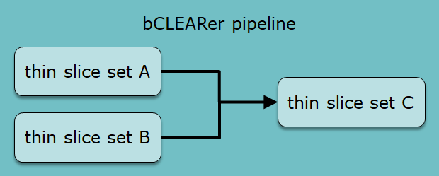
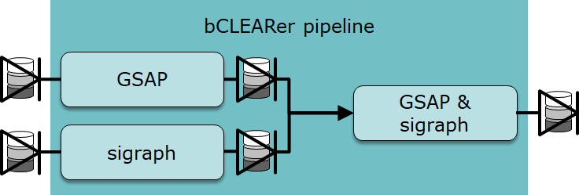
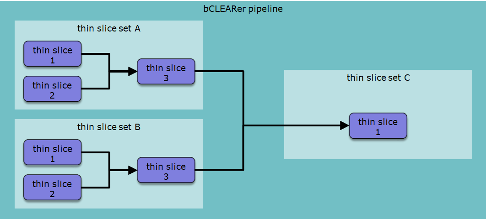
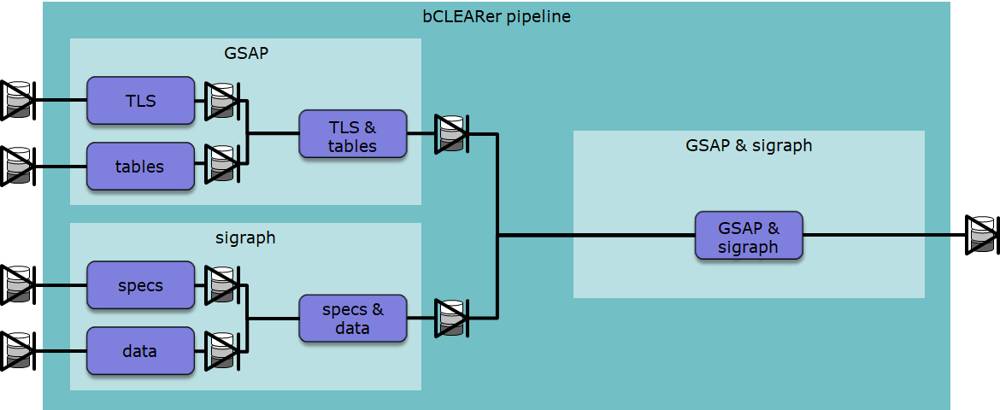
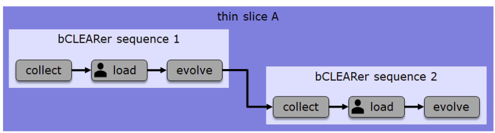
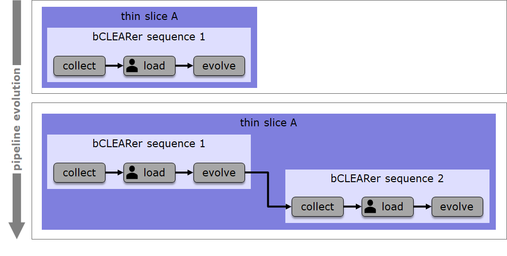
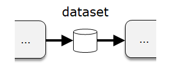

# TtDT - Report - bCLEARer pipeline\'s three nesting levels

[]{#Bookmark37}

# [Introduction]

In the previous section, we noted that bCLEARer pipelines are typically
quite large and could benefit from a hierarchical, nesting structure. In
this section we look in more detail at the levels of this nesting
structure. This is an essential part of the stable bCLEARer
infrastructure, the environment, within which the transformations
evolve. The bCLEARer pipeline's primary nesting is based upon three
broad levels (shown below). Within each level there may be further
secondary nesting, allowing for as many levels of nesting as is useful
at each level.

**bCLEARer nesting decomposition levels**

  ---------------------- ------------------------------------------------------------------------------------------------------------------
  (Domain) thin slices   the base unit of the breakdown of scope into domains
  bCLEARer stages        the base unit of the stages of the bCLEARer digital journey
  bUnits                 the base unit of the bCLEARer pipeline architecture, composed of the bUnit filter and its associated bUnit pipes
  ---------------------- ------------------------------------------------------------------------------------------------------------------

*source*: [bCLEARer nesting decomposition
levels](https://borocvi.atlassian.net/wiki/spaces/SB/pages/5775982601/bCLEARer+nesting+decomposition+levels "https://borocvi.atlassian.net/wiki/spaces/SB/pages/5775982601/bCLEARer+nesting+decomposition+levels")

Sometimes it is conceptually cleaner to describe the hierarchy from the
bottom up starting from the base unit. In practice, the design often
starts with the overall scope and decomposes this into base units. We
follow this design practice [[in this section, where we
]{.inline-comment-marker
ref="20adcad8-8c42-4024-a179-60e7c0b9feac"}]{.inline-comment-marker
ref="8fd32520-c187-4a0f-8196-5042cb47accb"}[[[describe]{.inline-comment-marker
ref="20adcad8-8c42-4024-a179-60e7c0b9feac"}]{.inline-comment-marker
ref="8fd32520-c187-4a0f-8196-5042cb47accb"} ]{.inline-comment-marker
ref="8f4845a7-911d-41fc-8bf3-5e73fb3c2fa9"}this nesting by level from
the bCLEARer Pipeline down.

[]{#Bookmark38}

# (Domain) thin slices {#Bookmark38}

At the first, domain, level of decomposition the bCLEARer pipeline is
decomposed into thin slices. The bCLEARer Pipeline can cover one [or
]{.inline-comment-marker ref="40632220-8c26-4577-9402-f15715db0ec4"}more
domains. [With ]{.inline-comment-marker
ref="8f0bf4c5-0519-4e73-afbc-4a3f3e0445ce"}any sizeable domain (or
domains), it makes sense to divide this into sub-pipelines focussing [on
]{.inline-comment-marker
ref="17c0cc03-fbf3-47c8-825b-db277a8ead5f"}smaller domain-based chunks .
[Where there are [dependencies between the chunks, these need to be
recognised in the bCLEARer pipeline flow]{.inline-comment-marker
ref="80aabace-6636-4403-8f56-4abcc94ed6f3"}. ]{.inline-comment-marker
ref="1b4dcd20-f0cb-4735-9e8d-264cb17f620e"}At the domain level, the base
unit of chunking is the thin slice - this is where the domain
decomposition stops. If it is useful, when the domain is large and will
have a lot of thin slices, the decomposition can process in stage where
the initial decompositions are into thin slice sets -- pipelines
composed of thin slices.

[]{#Bookmark39}

## Thin slice sets {#Bookmark39}

When designing the nesting structure for the domain, it often makes
sense to start with the overall bCLEARer pipeline and make a series of
decompositions down until one reaches [the level of thin
slices.]{.inline-comment-marker
ref="242e707e-3506-4a03-a09d-2049307e7dfb"} Where these decompositions
are driven by domain considerations. A pro-forma example of a first
stage decomposition of a bCLEARer pipeline into thin slice sets
(filters), [where the flow is ordered by pipes]{.inline-comment-marker
ref="463a83ca-1409-4d85-8b93-6cba83a938ae"} is shown in the [figure
]{.inline-comment-marker
ref="a059c787-5982-48b3-90a9-7f72e75cbbd3"}below.

[{.confluence-embedded-image
.image-center width="340"
height="136"}]

[Gates ]{.inline-comment-marker
ref="4fde5c9c-053c-475d-901c-49ff46428c22"}are placed at the start and
end of each [thin slice]{.inline-comment-marker
ref="5f557a75-6dd1-4802-a732-e6acaaf8a725"} set -- as shown in the
[figure below]{.inline-comment-marker
ref="c2d3b7ed-ad26-44ba-948d-902fd0643c8b"} using the dataset collection
icon. This figure is based upon a real example, which involved two
systems: GSAP and sigraph. The first two thin slice sets transformed the
two systems in isolation and the third thin slice set merged and
transformed the data from the two initial thin slice sets. Systems and
their sub-systems often form natural boundaries for [thin slice
sets]{.inline-comment-marker
ref="a56aa8a6-b2c7-4cab-8238-060b5697acfa"}.

[{.confluence-embedded-image
.image-center width="442"
height="149"}][]{#Bookmark40}

## Thin slices {#Bookmark40}

Each thin slice set is further broken down until the base-unit thin
slices are reached. [The breakdowns are also ordered using
pipes]{.inline-comment-marker
ref="bbbfa209-b2bb-4f45-b840-03aa30a17623"}, as shown in the pro-forma
nesting diagram in the figure [below]{.inline-comment-marker
ref="cb38b01d-70df-4d7f-b79e-8962a9c15cfe"}.

[

Again, gates are placed at the start and end of each thin slice. This is
shown in a real example in the nesting diagram in the [figure below.
]{.inline-comment-marker ref="7c0fc343-6206-414f-9489-779ef0c36ed7"}

[

This figure shows the merging of data within thin slice sets as well as
across thin slice sets. This is not unusual, often a significant amount
of the bCLEARer pipeline deals with the merging of data from different
sources.

[]{#Bookmark41}

# bCLEARer stages {#Bookmark41}

At the next level of decomposition, the thin slice pipelines decompose
into bCLEARer stages. These stages mark the stage of digital journey the
data is on. Where there are many such stages, it can be useful to nest
them into sub-pipelines. This is described below.

The need to mark the stage of digital journey the data is on leads to a
major constraint upon bCLEARer stages -- they should flow in a sequence
that reflects the journey. The sequence is well established (see first
figure below).

[{.confluence-embedded-image
.image-center width="624"
height="73"}]

The bCLEARer stages are gated -- as shown in the figure below.

[

There is significant scope for organising these stages into a series of
sequences -- see example below, where one sequence follows another.

[

Also, the thin slice pipeline will typically evolve during a project --
as shown in the example below.

[

Sometime the pipeline involves manual work. As manual work interferes
with running, scaling and costs, the aim is as far as possible to
automate this work. Where it cannot be automated, it is often a good
idea to restrict it to the Load stage, moving the manual work to the
early stages in the sequence. In bCLEARer stage diagrams we usually mark
the stages that involve manual work, using an icon -- this is visible in
the Load stage in the diagram above. The manual icon is shown below.

[{.confluence-embedded-image
.image-center}]{.confluence-embedded-file-wrapper
.image-center-wrapper}[]{#Bookmark42}

# bUnits {#Bookmark42}

The bCLEARer stage pipelines decompose into bUnits -- [[the base unit of
the bCLEARer pipeline, these are not decomposed any
further]{.inline-comment-marker
ref="af215268-4b89-4ce1-b17d-25503d67b835"}]{.inline-comment-marker
ref="a49421b7-e1d8-4805-b4ba-d0d39a2085f5"}. As at the other levels,
[these ]{.inline-comment-marker
ref="90a90a80-3e66-4ce7-af2e-3a2c7c156fa7"}can be organised into
secondary levels. The pipes in bUnits work at the finer-grained level of
datasets rather than dataset collections. In diagrams, the bUnit pipes
are adorned with the dataset icon, as shown below.

[

As the bCLEARer stages are gated, the bUnits need to be designed to
accommodate the gates -- this is shown as start and end bUnits in the
figure below, as are the finer-grained datasets.

[

Sometimes, unavoidably, a bUnit will be manual. This is marked using the
manual icon -- there is an example of this in the diagram above.

[]{#Bookmark43}

## bUnit - base unit for transformation, difference and identity {#Bookmark43}

In the bUnit pipeline architecture, the bUnit pipes are the base units
of identity and difference, and the bUnit filters the base units of
transformation. In this architecture, the pipes transport data, the data
is not transformed - so it is immutable stage of the data through the
flow. The flow can then be seen as a sequence of bUnit immutable stages,
where any transformation is located in the filters linking the stages.
