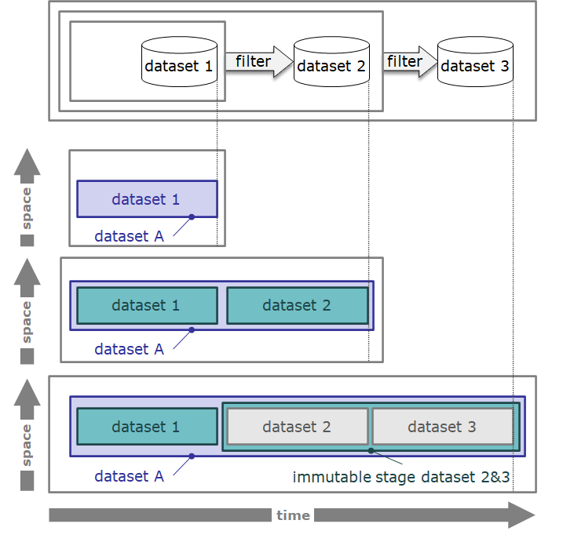
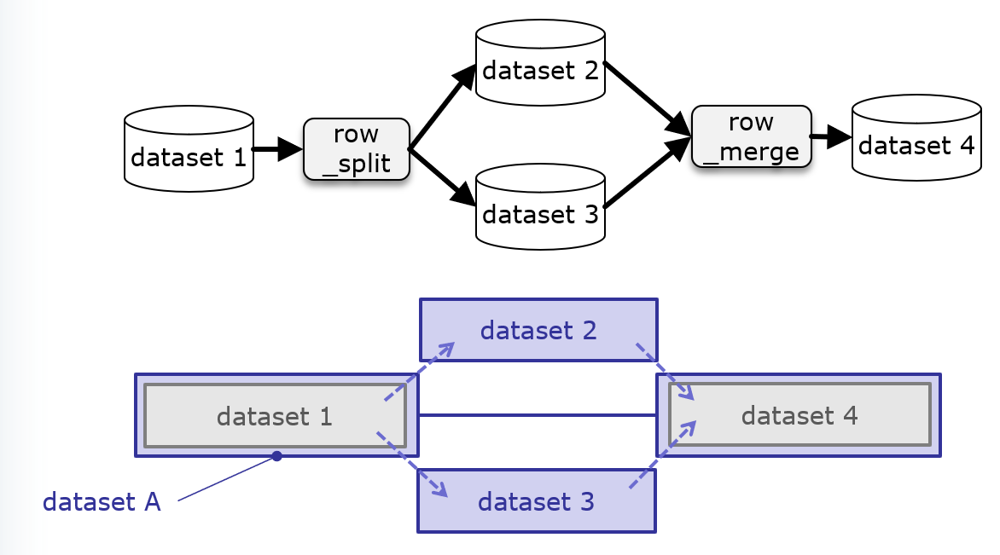
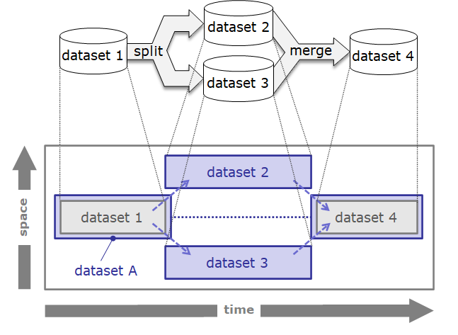

# TtDT - Report - Building resilient transformation transparency into the bCLEARer pipeline

# Introduction 

This section describes how resilient transformation transparency is
built into the bCLEARer pipelines. The focus is on building in
transparency from the bottom up, starting with the bUnits in the
bCLEARer stages. This transparency is then inherited up the levels of
the bCLEARer pipeline.

The building is done in similar ways at two levels of data granularity:

-   dataset, and

-   data item.

The sub-sections describe these two levels.

In each subsection the following topics are covered:

-   firstly, a general notion of algorithmic identity, from which
    difference and so transformation can be established, and

-   secondly, how to implement transparency in the individual bCLEARer
    stage pipelines through tracking, tracing and testing
    transformations.

[]{#Bookmark52}

## Algorithmic identity {#Bookmark52}

For both levels of granularity (dataset, and data item), there are two
core types of identity:

-   data identity, and

-   data content immutability (stage) identity.

These are both based upon data item identities to facilitate their
algorithmic processing.

As discussed earlier, in the bCLEARer pipeline architecture, data's
bUnit (pipe) stages are necessarily content immutable. This enables us
to build the two core types of algorithmic identity from the base bUnit
stage identity.

Together these give the six types of transformation shown below.

  --------------- ------------------------- ------------------------------------------------------ ----------------------------------
                  **data identity**         **data content immutability (stage) identity**         **bUnit (stage) identity**
  **dataset**     dataset (item) identity   dataset (item) content immutability (stage) identity   dataset bUnit (stage) identity
  **data item**   data item identity        data item content immutability (stage) identity        data item bUnit (stage) identity
  --------------- ------------------------- ------------------------------------------------------ ----------------------------------

*[identity transformation types]{style="color: rgb(255,86,48);"}*

[One can also keep a rough track on identity through counts if one
wishes. ]{.inline-comment-marker
ref="7ae28944-4213-4942-ba63-71342bcae43e"}This is a much weaker version
of data identity and so we do not discuss it here.

[]{#Bookmark53}

### Coinciding identity {#Bookmark53}

bCLEARer has adopted an extensional notion of identity. This leads to
cases where data identities (extensionally) coincide. To help us
visualise the identities, we associate colours with them as shown below.

[]

The three life histories in the figure below illustrate this. In the top
life history, the dataset only exists in the dataset 1 pipe and so all
identities coincide. Dataset 1 is a bUnit stage, a data content
immutability stage and a dataset. In the middle life history, dataset A
persists through the bUnit pipes dataset 1 and dataset 2, but the
content changes. So both bUnit stages are also data content immutability
stages.[ ]{style="color: rgb(255,86,48);"}In the bottom life history,
the dataset persists through three bUnit stages, and the content changes
through the first two and persists in the third. This third bUnit,
dataset 3, is a bUnit stage and a part of a data content immutability
stage with dataset 2.\
\
[AGu - ]{style="color: rgb(76,154,255);"}[Chris
Partridge](https://borocvi.atlassian.net/wiki/people/557058:8b873d57-d08e-4006-a7af-cd2822848a58?ref=confluence "https://borocvi.atlassian.net/wiki/people/557058:8b873d57-d08e-4006-a7af-cd2822848a58?ref=confluence"){.confluence-userlink
.user-mention .current-user-mention
username="557058:8b873d57-d08e-4006-a7af-cd2822848a58"
account-id="557058:8b873d57-d08e-4006-a7af-cd2822848a58" target="_blank"
linked-resource-id="32783" linked-resource-version="2"
linked-resource-type="userinfo"
base-url="https://borocvi.atlassian.net/wiki"}[ possible worlds,
counterparts ]{style="color: rgb(76,154,255);"}\
[AGu - I removed the evolution arrow]{style="color: rgb(76,154,255);"}\

[

Also as this figure shows upon inspection, there are levels of dataset
identity. The objects with lower levels of identity type are either
coincident with or part of the higher levels; so a bUnit stage is either
coincident with a data content immutability stage or part of one and a
data content immutability stages is either coincident with a dataset or
part of one.

Every possible combination of coincidences is allowed as shown in the
table below. In the table, where there is a coincidence, the higher
level of identity type is highlighted in green.

  ------------------------------------- ---------------- ----- ----- ----- ----- ----- -----
  **type**                              **is allowed**                                 
  **data**                              yes              no    no    no    yes   yes   yes
  **data content immutability stage**   no               yes   no    yes   no    yes   yes
  **data bUnit stage**                  no               no    yes   yes   yes   no    yes
  ------------------------------------- ---------------- ----- ----- ----- ----- ----- -----

*[combinations of coincident identity transformation
types]{style="color: rgb(255,86,48);"}*

Where there is a coincidence, each identity type might have a name, if
so, this will result in the coincident object having multiple names.

[]{#Bookmark54}

### An algorithmic notion of identity (and so difference) {#Bookmark54}

There are ways of algorithmically calculating identity and immutability
for datasets and data items. The details are in the sub-sections and in
[TtDT - Report - Appendix - bH - bHashing and
bSumming](page5768839184.html#Bookmark95 "TtDT - Report - Appendix - bH - bHashing and bSumming"){linked-resource-id="5768839184"
linked-resource-version="4" linked-resource-type="page"}.

This approach defines transformation in terms of identity and its
complement difference. 'A difference that makes a difference\' can be
seen, in this context, as the essence of a transformation. We should not
account for a difference that makes no difference as a transformation of
interest. By developing a clear algorithmic notion of identity (and so
difference) one has the basis for developing automatic accounting
processes for checking whether there are differences and so
transformations when there should be identity -- or where there are
differences that can be summed into an identity.

One consequence of using algorithmic identity is that it leads to the
existence of intermittent objects. Consider, as shown below, a dataset
that is split and then subsequently merged -- where the merged dataset
has exactly the 'same' rows as the original dataset. Then as the life
history below shows the original and final datasets are stages of the
same dataset -- as they have the same data identity.

[AGu: initial picture]{style="color: rgb(76,154,255);"}

[

[AGu: updated picture]{style="color: rgb(76,154,255);"}

[

[]{#Bookmark55}

## Building algorithmic identity-based transparency {#Bookmark55}

Building transparency is done in two stages:

-   mapping (and reviewing) the intended pipeline transformations, and

-   testing the pipeline transformations happen as intended.

The transformation mapping has two elements; tracking and tracing.
Tracking finds the intended footprint of the data identities and tracing
maps the intended identity transformations.

The testing compares the intended tracking and tracing with what happens
in the actual runs.

As in other sections, more technical details, including most references
to useful literature have been relegated to appendices, which are
referred to in the text.
