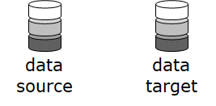
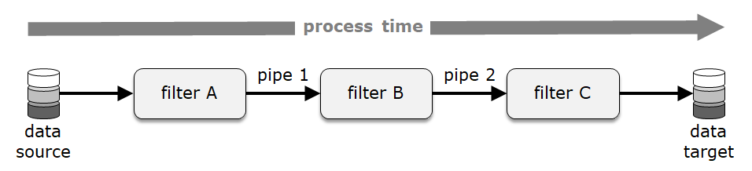
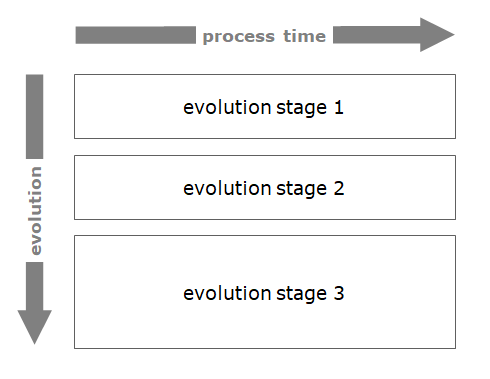
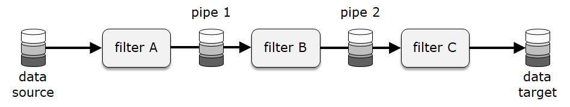
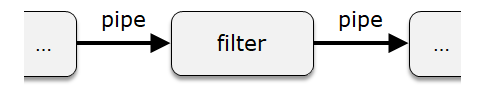
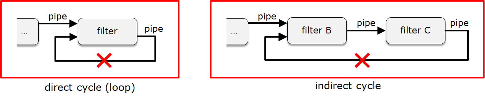
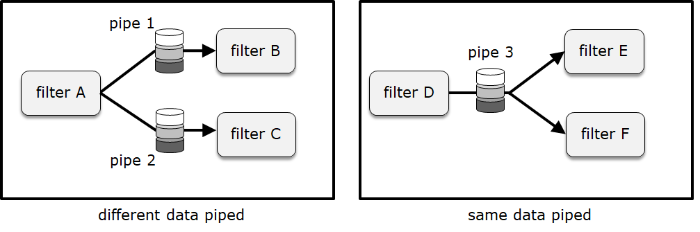
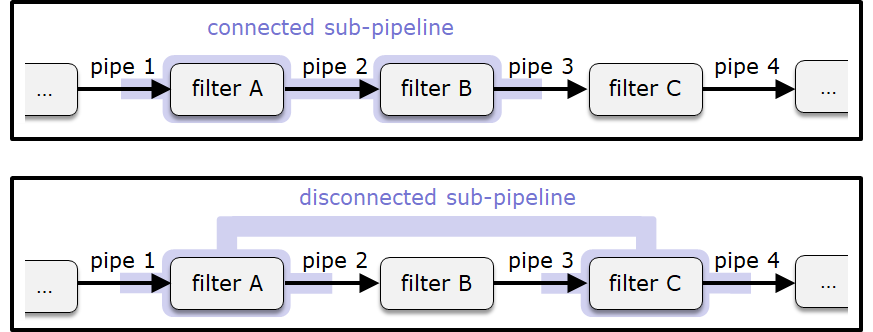
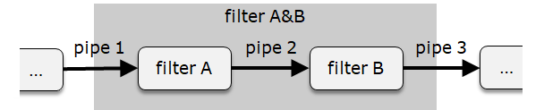
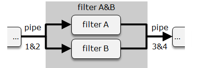

# TtDT - Report - bCLEARer\'s pipeline or pipe-and-filter architecture

# Introduction {#Bookmark12}

As is often noted in the literature (see, for example, the extract in
[Appendix - The standard \'Pipeline\' or \'Pipe-and-Filter\'
Architecture](https://borocvi.atlassian.net/wiki/spaces/SB/pages/5773197350/Appendix+-+The+standard+%27Pipeline%27+or+%27Pipe-and-Filter%27+Architecture "https://borocvi.atlassian.net/wiki/spaces/SB/pages/5773197350/Appendix+-+The+standard+%27Pipeline%27+or+%27Pipe-and-Filter%27+Architecture"){linked-resource-id="5773197350"
linked-resource-version="13" linked-resource-type="page"}), data
transformation systems typically have a 'pipeline' or 'pipe-and-filter'
architecture. (\'Pipe-and-filter\' is the original name for this
architecture, though 'pipeline' is a more common name nowadays.) The
bCLEARer approach is a data transformation process and so,
unsurprisingly, is implemented with a pipeline architecture -- giving
rise to a bCLEARer pipeline. Large pipelines are typically given a
hierarchical, nesting structure to facilitate management - the specifics
of this are discussed in the next section. In this section, we look at
the pipeline architecture, including how it can be nested.

[]{#Bookmark13}

# Visualising the pipeline flow {#Bookmark13}

[This architecture]{.inline-comment-marker
ref="f2d0e600-cc88-4038-86bd-247574e3f9d1"} consists of a sequence of
processing components, arranged so that the output of each component is
the input of the next one creating a 'flow'. A simple visualisation of a
pipeline flow is given below:

[

\
[The pipeline architecture has, as the \'pipe-and-filter\' name
suggests, a series of pipe and filter components, where pipes pass data
to and from filters that transform the passed data - the pipeline
flow.]{.inline-comment-marker
ref="211d1c6a-8948-44fa-9071-e4eab05bc8ee"} As well as the general
inter-filter pipes, t[here are ]{.inline-comment-marker
ref="e9b81eeb-f051-4e89-a342-5a08fba0b790"}[[two specific types of
pipes]{.inline-comment-marker
ref="e9b81eeb-f051-4e89-a342-5a08fba0b790"}]{.inline-comment-marker
ref="dcca3279-02f2-44e4-a470-e58f94b6b8af"}, the [start and end pipes;
]{.inline-comment-marker ref="211d1c6a-8948-44fa-9071-e4eab05bc8ee"}a
data source (pipe) to feed the pipeline and a data target (pipe) to
persist the transformed data. As illustrated in the figure above, these
pipes are typically adorned with a dataset collection icon (as shown
below).

[{.confluence-embedded-image
.image-center}]{.confluence-embedded-file-wrapper
.image-center-wrapper}[]{#Bookmark14}

# Process time {#Bookmark14}

Conventionally, the pipeline flow - pipes passing data and filters
transforming it - is shown across the diagram from left to right. This
is made explicit in some diagrams with the use of a 'process time'
arrow, as shown below.

[{.confluence-embedded-image
.image-center}]{.confluence-embedded-file-wrapper
.image-center-wrapper}[]{#Bookmark15}

# Evolutionary time {#Bookmark15}

[The ]{.inline-comment-marker
ref="3089a09a-2bd3-41c2-90cb-1b9d830b98c5"}[[flow itself will typically
evolve over time]{.inline-comment-marker
ref="3089a09a-2bd3-41c2-90cb-1b9d830b98c5"},]{.inline-comment-marker
ref="16019b8f-4a83-4037-8adf-527652066be1"} pipes and filters may be
added and removed - or changed. One needs be able to represent this
evolution in diagrams. This is typically represented as a series of
snapshots of the pipeline (process) arranged down the page with an arrow
from top to bottom showing the direction of evolution -- a pro-forma
example of this is in the figure below.

[{.confluence-embedded-image
.image-center}]{.confluence-embedded-file-wrapper
.image-center-wrapper}[]{#Bookmark16}

# Pipeline components {#Bookmark16}

The pipeline has two core components, \'filters\' and \'pipes\'
(including the [data source and data target
pipes).]{.inline-comment-marker
ref="a3be927c-c261-40ef-b401-b210c4f772a9"}

[]{#Bookmark17}

## Filters {#Bookmark17}

Filters are components that transform (\'filter\') data that is received
as an input via pipe connectors. The icon for a filter is shown below:

[{.confluence-embedded-image
.image-center}]{.confluence-embedded-file-wrapper
.image-center-wrapper}[]{#Bookmark18}

## Pipes {#Bookmark18}

Pipes are the connectors for filters. The role of a pipe is to pass
messages, or information, to and from filters. The flow is
unidirectional, and, when needed in an implementation, the data is
persisted [until]{.inline-comment-marker
ref="442ff4a2-b5e2-4456-ada5-38c49d6703d2"} the filter processes it. The
icon for a pipe is shown below:

[{.confluence-embedded-image
.image-center}]{.confluence-embedded-file-wrapper
.image-center-wrapper}[]{#Bookmark19}

### [Pipes adorned with data]{.inline-comment-marker ref="6d57a692-1168-49ec-9e4a-08e1d1d80868"} {#Bookmark19}

[As noted earlier, there is a data source pipe at the start of the
pipeline to feed it and a data target pipe at the end of the pipeline to
persist the transformed data. And these are usually adorned with a
dataset collection icon. All pipes, not just the start and end pipes,
transport data. Optionally, this point can be highlighted through the
use of a data icon (in this case, the dataset collection icon) on all
pipes in the diagram including those pipes inside the pipelines -- as
shown below for pipes 2 and 3.]{.inline-comment-marker
ref="7ea67c64-f77f-4ab2-92db-55a665d623e4"}

[{.confluence-embedded-image
.image-center}]{.confluence-embedded-file-wrapper
.image-center-wrapper}[]{#Bookmark20}

# Filters and their pipes {#Bookmark20}

Filters always have an input pipe and an output pipe, as shown in the
following diagram:

[{.confluence-embedded-image
.image-center width="340"
height="61"}][]{#Bookmark21}

## Acyclic pipeline flow {#Bookmark21}

A filter's pipe cannot flow to itself, either directly or indirectly.
The flow is acyclic -- with no cycles. This does not inhibit reuse, as
the same processing may be reused in different filters.

[{.confluence-embedded-image
.image-center}]{.confluence-embedded-file-wrapper
.image-center-wrapper}[]{#Bookmark22}

## Multiple pipes to and from different filters {#Bookmark22}

A filter can have several input pipes and several output pipes, as shown
in the following diagram:

[{.confluence-embedded-image
.image-center width="340"
height="205"}][]{#Bookmark23}

### Merging and splitting pipelines {#Bookmark23}

Filters with multiple input and output pipes can be organised into
pipeline flows that split and then merge -- as shown below.

[{.confluence-embedded-image
.image-center width="340"
height="168"}][]{#Bookmark24}

### [Multiple pipes between the same filters]{.inline-comment-marker ref="12ac3dba-793e-438b-8455-70fb414ab9d2"} {#Bookmark24}

None of a filter\'s pipes should flow to the same destination -- where
this happens, the pipes should be encapsulated - as shown in the diagram
below.\

[{.confluence-embedded-image
.image-center}]{.confluence-embedded-file-wrapper
.image-center-wrapper}[]{#Bookmark25}

### [Pipes: single or multiple filter inputs ]{.inline-comment-marker ref="29f86689-f1a3-4a12-bc6a-44ef729d26f4"} {#Bookmark25}

[Typically a pipe will have a single filter output fed by a single
filter input.]{.inline-comment-marker
ref="97896ef2-9a31-4021-b7ae-f0a526fefdcb"} However, there can be cases
where it is important to record that the same data is fed from one
filter to many other filters. In these cases, the pipe is shown with a
single filter output feeding multiple filter inputs. Pro-forma examples
of these two cases are in the figure below.

[{.confluence-embedded-image
.image-center}]{.confluence-embedded-file-wrapper
.image-center-wrapper}[]{#Bookmark26}

# Nesting {#Bookmark26}

Any subset of filters in a pipeline forms a sub-pipeline, however, it
can be useful to distinguish between pipelines that are connected and
disconnected -- see below.\
\

[{.confluence-embedded-image
.image-center width="442"
height="168"}]

This makes it simple to organise a sub-pipeline into a nested pipeline
-- as shown below.

[{.confluence-embedded-image
.image-center width="442"
height="197"}]

One can view the nesting in a diagram - as shown below.

[{.confluence-embedded-image
.image-center width="442"
height="89"}][]{#Bookmark27}

## Nesting -- pipe encapsulation {#Bookmark27}

Where a nesting is going to encapsulate a number of filters, one
consequence may be that a filter outside the nesting, whose pipes
previously fed into multiple filters, now feeds into (or is fed from) a
single encapsulated filter. In this case, the rule \'Multiple pipes
between the same Filters\' mentioned above comes into play, and the
pipes need to be [encapsulated ]{.inline-comment-marker
ref="5eaca54b-1ad1-4840-9d07-06bda21c7456"}to ensure in the nested
pipeline there are not multiple pipes between the same (nested)
filters - as shown in the figure below (as an aside, note the
sub-pipeline is technically disconnected).

We can see the original [multiple pipes]{.inline-comment-marker
ref="36a5b8c5-4fd2-411e-a5f4-9d2033fbbc62"} in the nesting diagram - as
shown in the figure below.

