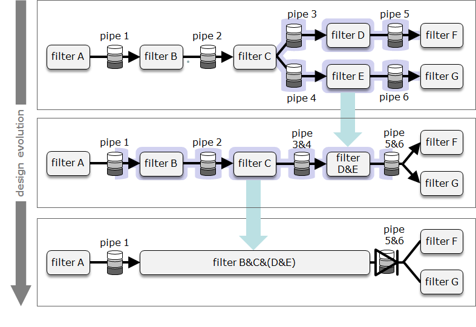

# TtDT - Report - bCLEARer\'s nested gated pipeline architecture

# Introduction {#Bookmark29}

bCLEARer pipelines are often quite large, and as noted earlier, large
pipelines are typically given a hierarchical, nesting structure to
facilitate management. In this section, we look at the specific nesting
strategies adopted by bCLEARer pipelines. [Within the overall pipeline
architecture, the bCLEARer pipeline has a gated nesting structure. The
first sub-section looks at the nesting, the second at the
gating.]{.inline-comment-marker
ref="94a61a44-2223-44ca-9332-3ed5a85f1c58"}

[]{#Bookmark30}

# The bCLEARer pipeline's multi-level nesting structure {#Bookmark30}

The bCLEARer pipeline's multi-level nesting structure is described in
this section.

[]{#Bookmark31}

## Multi-level nesting {#Bookmark31}

As noted earlier, within a pipeline architecture, one can encapsulate
sub-pipelines as filters (with pipes). These encapsulated components can
themselves be nested, creating a multi-level nesting (breakdown)
structure in the pipeline.

[

One can view the encapsulation structure in a nesting diagram - as shown
below.

../assets/img_22.png){.confluence-embedded-image
.image-center width="624"
height="92"}]

The final nesting is of all the filters into a single
overall-pipeline-level filter.

[

From the perspective of this top level final pipeline, the nesting is a
series of decompositions. These can be a fixed series of decompositions
into levels, where each decomposition takes the units at one level and
divides them into units at the next level. This breaks down the overall
process into levels, with base (undivided) units at the bottom level --
as shown in the figure below.

[{.confluence-embedded-image
.image-center}]{.confluence-embedded-file-wrapper
.image-center-wrapper}[]{#Bookmark32}

## bCLEARer nesting decomposition levels {#Bookmark32}

The bCLEARer pipeline is composed of three broad [levels of nested
pipelines]{.inline-comment-marker
ref="861ac95b-2424-4a63-a32b-3f0fad1d4af3"} (described in more detail
later), based on the type of base filter:

**bCLEARer nesting decomposition levels**

  ---------------------- ------------------------------------------------------------------------------------------------------------------
  (Domain) thin slices   the base unit of the breakdown of scope into domains
  bCLEARer stages        the base unit of the stages of the bCLEARer digital journey
  bUnits                 the base unit of the bCLEARer pipeline architecture, composed of the bUnit filter and its associated bUnit pipes
  ---------------------- ------------------------------------------------------------------------------------------------------------------

*source*: [bCLEARer nesting decomposition
levels](https://borocvi.atlassian.net/wiki/spaces/SB/pages/5775982601/bCLEARer+nesting+decomposition+levels "https://borocvi.atlassian.net/wiki/spaces/SB/pages/5775982601/bCLEARer+nesting+decomposition+levels")

This can be visualised as a three-level[ ]{.inline-comment-marker
ref="70a72c9f-0354-4a94-8b25-8635f2df1689"}breakdown.\

[

Within each level there may be further unrestricted secondary nesting,
with as many levels of nesting as is useful.

[]{#Bookmark33}

# Nested [pipeline's data stage gates]{.inline-comment-marker ref="afa56197-aef7-4002-832c-aa73a6689487"} {#Bookmark33}

The nested pipeline data stage gates are described in this section.

[]{#Bookmark34}

## The data stage gates {#Bookmark34}

[Where appropriate, the nested pipelines are designed with their input
and output pipes as data stage gates]{.inline-comment-marker
ref="085ea720-4c84-4838-9541-05206763f3dc"}. Typically, bCLEARer stage
and thin slice pipelines have these gates. This dual (input and output)
gate design for nested pipelines enables the original and transformed
data to be inspected and compared. To assist with this, the design of an
output gate\'s data also aims to clean it sufficiently to provide a SSOT
([TtDT - Report - Appendix - Aggregated S(ingle) S(ource) O(f)
T(ruth)](page5773328385.html#Bookmark104 "TtDT - Report - Appendix - Aggregated S(ingle) S(ource) O(f) T(ruth)"){linked-resource-id="5773328385"
linked-resource-version="3" linked-resource-type="page"}) snapshot of
its state at this stage of its digital journey. Where an input gate is
an output gate of the previous process, it will also be in a SSOT
snapshot. And in so doing, one can make the journey\'s transformations
visible by comparing snapshots. In the bCLEARer process, these
stage-gates are not decision points (as they are in some waterfall
processes); though where data fails an inspection, it may be held back
if required. The focus is on inspection not decision in an agile
iterative process.

Establishing data gates for nested pipelines, especially SSOT data
gates, is a very cost effective way of creating inspection points that
can greatly simplify improving and maintaining quality. It helps, for
example, in the identifying of the source of problems: finding the first
gate at which a problem appears, isolates between which gates it arose.
[ One of the drivers in the design of the nesting structure is ensuring
the gaps between gates are sufficiently small to make finding problem
data easy. ]{.inline-comment-marker
ref="28973395-2ee7-4abd-af44-b260c9b96c43"}

[]{#Bookmark35}

## Designing a gate {#Bookmark35}

Hence, g[ates are designed into the process.]{.inline-comment-marker
ref="e13d2506-bca6-4408-8cbe-fcc690a88345"} The design involves two
layers of nesting. Given a pipeline that needs to be gated at one end,
one needs to create a pipe that aggregates all the data flowing through
that end of the pipeline. One way of doing this is creating a nesting
that encapsulates all the filters with pipes that travel outside the
pipeline. This will encapsulate the outgoing pipes into a single
(aggregated) pipe, an example of this is given in the figures below.

In this figure, the filters are just encapsulated. This results in the
unaggregated output of two pipes -- [pipe 5 and pipe
6.]

In this figure, the pipes are encapsulated first and then the filters.
This results in the aggregated output of a single pipe -- pipe 5&6.

This diagram includes the gate icon, as shown below.

[{.confluence-embedded-image
.image-center width="204"
height="79"}]

The data icon is typically adorned with a gate icon if the data is
gated, as shown below.

[{.confluence-embedded-image
.image-center width="204"
height="80"}]

As usual, we can look at a nesting diagram to see the lower level
structure hidden in the simple pipeline diagram - as shown in the figure
below.

