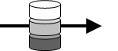
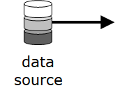
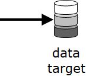

# TtDT - Report - Appendix - Reference Iconography - Research

~~AGu - Introductory note for appendix:~~\
\
~~Two main requirements for any bCLEARer project described in the
report~~

-   ~~the nested pipeline architecture~~

    -   ~~provides the infrastructure in which the data transformations
        unfold~~

-   ~~the mapping (tracking and tracing) and testing based on the
    identification of data identities~~

    -   ~~ensure that transparency is built into the bCLEARer pipeline~~

~~To provide a design-level illustration of the implications of these
two main requirements, two main set of icons and diagrams have been
developed:~~

-   ~~pipeline architecture iconography; encompasses:~~

    -   ~~pipeline lower level component icons:~~

        -   ~~filter icons, pipe and data icons~~

        -   ~~where the data icons present the particularity of having
            different functions according to a perspective:~~

            -   ~~a function of pipe adornment in a process and data
                type perspective~~

            -   ~~a function of pipe, in a data type perspective~~

        -   ~~these lower level components can be classified according
            to their function: pipe or filter~~

    -   ~~pipeline simple diagrams built from the lower level component
        icons~~

    -   ~~more complex pipeline nesting evolution diagrams, that
        illustrate the nesting structure that characterises the bCLEARer
        pipeline~~

-   ~~life history icons and diagrams:~~

    -   ~~provide a visual way to illustrate the identification, tracing
        and inspection of flows of data identities for transformation
        transparency purposes~~

    -   ~~they are mainly based on the BORO Space Time Maps (bSTM)
        iconography, which provides an easy way to visualise
        four-dimensional objects~~

~~The two iconography sets are conjointly used~~

-   ~~to illustrate the footprint of individual bCLEARer stage pipelines
    in terms of data identities~~\
    \

*source:* [TtDT - Report - Appendix - Reference Iconography -
Research](../page5785092097#Bookmark190 "TtDT - Report - Appendix - Reference Iconography - Research")

##  Pipe {#Bookmark191}

  ------------------------------------------------------------------------------------------------------------------------------------------------------------ ---------------- ----------------------------------------------------
  **Icons**                                                                                                                                                    **Icon names**   **Notes**
  [{.confluence-embedded-image .image-center}]{.confluence-embedded-file-wrapper .image-center-wrapper}   pipe             
  [{.confluence-embedded-image .image-center}]{.confluence-embedded-file-wrapper .image-center-wrapper}   pipe             pipe icon adorned with the dataset collection icon
  [{.confluence-embedded-image .image-center}]{.confluence-embedded-file-wrapper .image-center-wrapper}   pipe             pipe icon adorned with the dataset icon
  [{.confluence-embedded-image .image-center}]{.confluence-embedded-file-wrapper .image-center-wrapper}   start pipe       pipe icon adorned with the data source icon
  [{.confluence-embedded-image .image-center}]{.confluence-embedded-file-wrapper .image-center-wrapper}   end pipe         pipe icon adorned with the data target icon
  [{.confluence-embedded-image .image-center}]{.confluence-embedded-file-wrapper .image-center-wrapper}   gate             
  [{.confluence-embedded-image .image-center}]{.confluence-embedded-file-wrapper .image-center-wrapper}   gate             gate icon adorned with the dataset collection icon
  ------------------------------------------------------------------------------------------------------------------------------------------------------------ ---------------- ----------------------------------------------------

## Filter {#Bookmark192}

  ------------------------------------------------------------------------------------------------------------------------------------------------------------ ------------------------------- ----------------------------------------------------
  **Icons**                                                                                                                                                    **Icon names**                  **Notes**
  [{.confluence-embedded-image .image-center}]{.confluence-embedded-file-wrapper .image-center-wrapper}   filter, also known as process   AGu - add bCLEARer palette?
  [{.confluence-embedded-image .image-center}]{.confluence-embedded-file-wrapper .image-center-wrapper}   filter                          
  [{.confluence-embedded-image .image-center}]{.confluence-embedded-file-wrapper .image-center-wrapper}   manual                          this icon adorns filters requiring a manual action
  ------------------------------------------------------------------------------------------------------------------------------------------------------------ ------------------------------- ----------------------------------------------------

[]{#Bookmark193}

##  Nesting {#Bookmark193}

+---------------------------+---------------------------+-----------+
| **Icons**                 | **Icon names**            | **Notes** |
+---------------------------+---------------------------+-----------+
| [{. |                           |           |
| confluence-embedded-image |                           |           |
| .image-center width="108" |                           |           |
| height="12"}]{.conflue    |                           |           |
| nce-embedded-file-wrapper |                           |           |
| .image-center-wrapper     |                           |           |
| .conflue                  |                           |           |
| nce-embedded-manual-size} |                           |           |
|                           |                           |           |
| Example:                  |                           |           |
|                           |                           |           |
| [{. |                           |           |
| confluence-embedded-image |                           |           |
| .image-center}]{.conflue  |                           |           |
| nce-embedded-file-wrapper |                           |           |
| .image-center-wrapper}    |                           |           |
+---------------------------+---------------------------+-----------+
| Single icon:              | encapsulation             |           |
|                           |                           |           |
| [{. |                           |           |
| confluence-embedded-image |                           |           |
| .image-left}]{.conflue    |                           |           |
| nce-embedded-file-wrapper |                           |           |
| .image-left-wrapper}      |                           |           |
|                           |                           |           |
| Example:                  |                           |           |
|                           |                           |           |
| [{. |                           |           |
| confluence-embedded-image |                           |           |
| .image-center}]{.conflue  |                           |           |
| nce-embedded-file-wrapper |                           |           |
| .image-center-wrapper}    |                           |           |
+---------------------------+---------------------------+-----------+
| Containers are            | container                 |           |
| represented with a        |                           |           |
| rectangular shape with no |                           |           |
| border.                   |                           |           |
|                           |                           |           |
| [{. |                           |           |
| confluence-embedded-image |                           |           |
| .image-center}]{.conflue  |                           |           |
| nce-embedded-file-wrapper |                           |           |
| .image-center-wrapper}    |                           |           |
|                           |                           |           |
| The following palette is  |                           |           |
| used for the background   |                           |           |
| colour of the containers  |                           |           |
| in the different levels   |                           |           |
| of the bCLEARer pipeline: |                           |           |
|                           |                           |           |
| [{. |                           |           |
| confluence-embedded-image |                           |           |
| .image-center width="108" |                           |           |
| height="242"}]{.conflue   |                           |           |
| nce-embedded-file-wrapper |                           |           |
| .image-center-wrapper     |                           |           |
| .conflue                  |                           |           |
| nce-embedded-manual-size} |                           |           |
+---------------------------+---------------------------+-----------+
| Processes are represented | [process                  |           |
| with a rectangular shape  | (filter)]{style=          |           |
| with rounded corners and  | "color: rgb(255,86,48);"} |           |
| a border.                 |                           |           |
|                           |                           |           |
| [{. |                           |           |
| confluence-embedded-image |                           |           |
| .image-center}]{.conflue  |                           |           |
| nce-embedded-file-wrapper |                           |           |
| .image-center-wrapper}    |                           |           |
|                           |                           |           |
| The following palette is  |                           |           |
| used for the background   |                           |           |
| colour of [processes      |                           |           |
| (filters)]{style=         |                           |           |
| "color: rgb(255,86,48);"} |                           |           |
| in the different levels   |                           |           |
| of the bCLEARer pipeline: |                           |           |
|                           |                           |           |
| [{. |                           |           |
| confluence-embedded-image |                           |           |
| .image-center width="108" |                           |           |
| height="274"}]{.conflue   |                           |           |
| nce-embedded-file-wrapper |                           |           |
| .image-center-wrapper     |                           |           |
| .conflue                  |                           |           |
| nce-embedded-manual-size} |                           |           |
+---------------------------+---------------------------+-----------+

[]{#Bookmark194}

## Axis {#Bookmark194}

  ---------------------------------------------------------------------------------------------------------------------------------------------------------------------------------------------------------------------- ------------------- --------------------------------------------------------------------------------------------------
  **Icons**                                                                                                                                                                                                              **Icon names**      **Notes**
  [{.confluence-embedded-image .image-center width="102" height="314"}]{.confluence-embedded-file-wrapper .image-center-wrapper .confluence-embedded-manual-size}   evolutionary time   
  [{.confluence-embedded-image .image-center}]{.confluence-embedded-file-wrapper .image-center-wrapper}                                                             evolution stage     [AGu: this is not an axis, but can it sit in the axis section?]{style="color: rgb(76,154,255);"}
  [{.confluence-embedded-image .image-center}]{.confluence-embedded-file-wrapper .image-center-wrapper}                                                             process time        
  ---------------------------------------------------------------------------------------------------------------------------------------------------------------------------------------------------------------------- ------------------- --------------------------------------------------------------------------------------------------

[]{#Bookmark195}

##    Space-time[ ]{style="color: rgb(191,38,0);"}[/ life history]{style="color: rgb(76,154,255);"} {#Bookmark195}

  ----------- ---------------- -----------
  **Icons**   **Icon names**   **Notes**
                               
                               
  ----------- ---------------- -----------

[]{#Bookmark196}

##  Commons {#Bookmark196}

  ----------- ---------------- -----------
  **Icons**   **Icon names**   **Notes**
                               
                               
  ----------- ---------------- -----------
